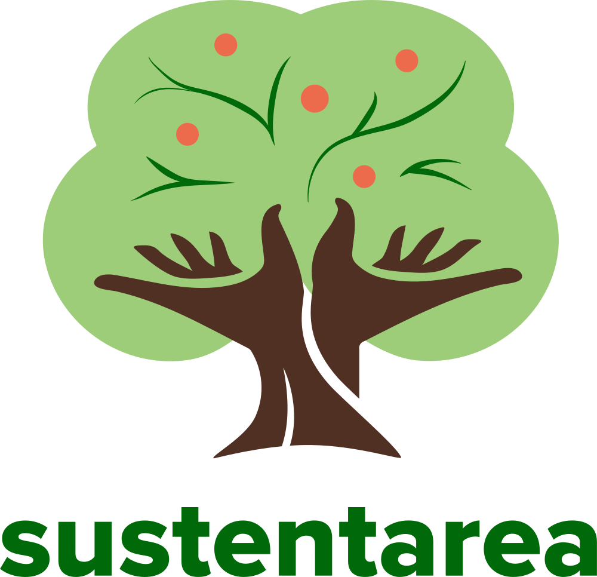

# sisvan-nutritional-status

<!-- badges: start -->
[](https://www.repostatus.org/#wip)
[](https://doi.org/10.17605/OSF.IO/8J94M)
[](https://www.gnu.org/licenses/gpl-3.0)
[](https://creativecommons.org/licenses/by-nc-sa/4.0/)
<!-- badges: end -->

## Overview

This repository provides a reproducible pipeline for processing microdata on nutritional status monitoring in Brazil from the Brazilian Food and Nutrition Surveillance System ([SISVAN](https://sisaps.saude.gov.br/sisvan/)), focusing on the nutritional status of children aged 0–5 years in Brazil.

If you are working with other age groups, you will need to adapt the code accordingly. We provide some guidance on how to do this along the report.

The report is available [here](https://sustentarea.github.io/sisvan-nutritional-status/).

> If you find this project useful, please consider giving it a star! &nbsp; [](https://github.com/sustentarea/sisvan-nutritional-status/)

> [!WARNING]
> This pipeline is still under development and may not be fully functional.
>
> This warning will be removed once the pipeline is complete.

## Data Availability

[](https://doi.org/10.17605/OSF.IO/8J94M)

The processed data are available in [`csv`](https://en.wikipedia.org/wiki/Comma-separated_values), [`rds`](https://rdrr.io/r/base/readRDS.html), and [`parquet`](https://en.wikipedia.org/wiki/Apache_Parquet) formats via a dedicated repository on the Open Science Framework ([OSF](https://osf.io)), accessible [here](https://doi.org/10.17605/OSF.IO/8J94M). Each dataset is accompanied by a metadata file describing its structure and contents.

You can also retrieve these files directly from [R](https://www.r-project.org/) using the [`osfr`](https://docs.ropensci.org/osfr/) package.

## Usage

The pipeline was developed using the [Quarto](https://quarto.org/) publishing system, along with the [R](https://www.r-project.org/) and [AWK](https://en.wikipedia.org/wiki/AWK) programming languages. To ensure consistent results, the [`renv`](https://rstudio.github.io/renv/) package is used to manage and restore the R environment.

Running the analyses requires an active internet connection. Do not use VPNs, corporate proxies, or other network-routing tools while processing the data, as these can interfere with the downloads.

Make sure the AWK executable directory is added to your [PATH](https://en.wikipedia.org/wiki/PATH_(variable)) environment variable.

After installing the four dependencies mentioned above, follow these steps to reproduce the analyses:

1. **Clone** this repository to your local machine.
2. **Open** the project in your preferred IDE.
3. **Restore the R environment** by running [`renv::restore()`](https://rstudio.github.io/renv/reference/restore.html) in the R console. This will install all required software dependencies.
4. **Open** `index.qmd` and run the code as described in the report.

## Rendering

After installing all the dependencies listed in the [Usage](#usage), run the following command in your terminal from the root directory of the project to render the report:

```bash
quarto render
```

These will activate the rendering process, which may take some time depending on your machine and internet connection speed. Once completed, the HTML report will be available in the `docs` folder.

## Citation

> [!IMPORTANT]
> When using this data, you must also cite the original data sources.

To cite this work, please use the following format:

Vartanian, D., Schettino, J. P. J., & Carvalho, A. M. (2025). *A reproducible pipeline for processing SISVAN microdata on nutritional status monitoring in Brazil* \[Computer software\]. Sustentarea Research and Extension Group, University of São Paulo. <https://sustentarea.github.io/sisvan-nutritional-status>

A BibLaTeX entry for LaTeX users is:

```
@software{vartanian2025,
  title = {A reproducible pipeline for processing SISVAN microdata on nutritional status monitoring in Brazil},
  author = {{Daniel Vartanian} and {João Pedro Junqueira Schettino} and {Aline Martins de Carvalho}},
  year = {2025},
  address = {São Paulo},
  institution = {Sustentarea Research and Extension Group, University of São Paulo},
  langid = {en},
  url = {https://sustentarea.github.io/sisvan-nutritional-status}
}
```

## License

[](https://www.gnu.org/licenses/gpl-3.0)
[](https://creativecommons.org/licenses/by-nc-sa/4.0/)

> [!IMPORTANT]
> The original data sources may be subject to their own licensing terms and conditions.

The code in this repository is licensed under the [GNU General Public License Version 3](https://www.gnu.org/licenses/gpl-3.0), while the report is available under the [Creative Commons Attribution-NonCommercial-ShareAlike 4.0 International](https://creativecommons.org/licenses/by-nc-sa/4.0/).

```
Copyright (C) 2025 Sustentarea Research and Extension Group

The code in this report is free software: you can redistribute it and/or
modify it under the terms of the GNU General Public License as published by the
Free Software Foundation, either version 3 of the License, or (at your option)
any later version.

This program is distributed in the hope that it will be useful, but WITHOUT ANY
WARRANTY; without even the implied warranty of MERCHANTABILITY or FITNESS FOR A
PARTICULAR PURPOSE. See the GNU General Public License for more details.

You should have received a copy of the GNU General Public License along with
this program. If not, see <https://www.gnu.org/licenses/>.
```

## Acknowledgments

<br>

<table>
  <tr>
    <td width="30%" align="center" valign="center">
      <a href="https://www.fsp.usp.br/sustentarea/"></a>
    </td>
    <td width="70%" valign="center">
      This work is part of a research project by the (<a href="https://www.fsp.usp.br/sustentarea/">Sustentarea</a>) Research and Extension Group of the University of São Paulo (<a href="https://usp.br/">USP</a>) titled: <em>Global syndemic: The impact of anthropogenic climate change on the health and nutrition of children under five years old attended by Brazil\'s public health system (SUS)</em>.
    </td>
  </tr>
</table>

<table>
  <tr>
    <td width="30%" align="center" valign="center">
        <a href="https://www.gov.br/cnpq/"></a>
    </td>
    <td width="70%" valign="center">
        This work was supported by the Department of Science and Technology of the Secretariat of Science, Technology, and Innovation and of the Health Economic-Industrial Complex (<a href="https://www.gov.br/saude/pt-br/composicao/sectics/">SECTICS</a>)  of the <a href="https://www.gov.br/saude/pt-br/composicao/sectics/">Ministry of Health</a> of Brazil, and the National Council for Scientific and Technological Development (<a href="https://www.gov.br/cnpq/">CNPq</a>) (grant no. 444588/2023-0).
    </td>
  </tr>
</table>
